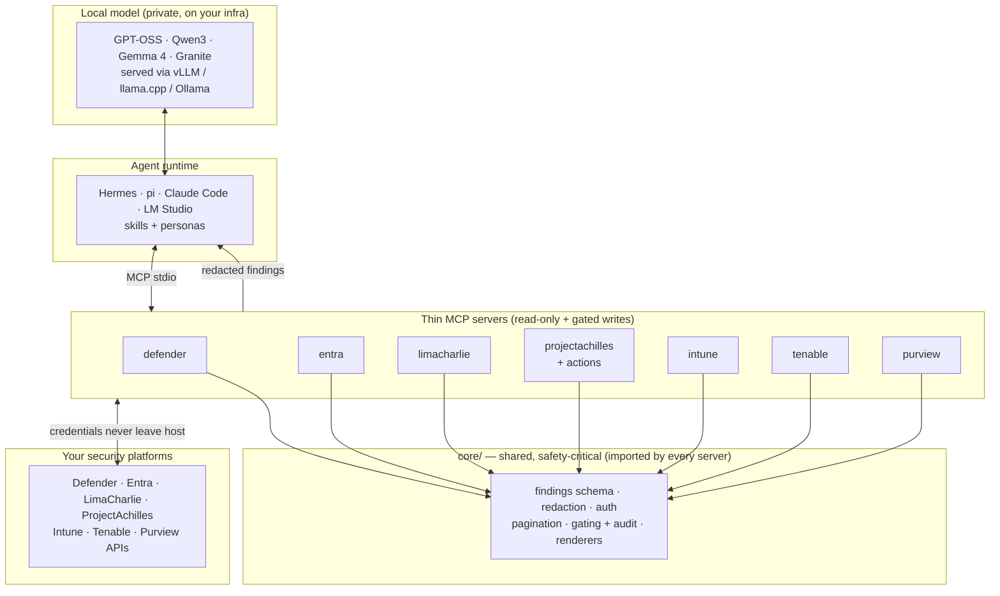

# f0_sectools — Security-Operations Tools & Skills for Local AI Agents

[](https://opensource.org/licenses/Apache-2.0)
[](https://www.python.org/)
[](https://github.com/ubercylon8/f0_sectools/actions/workflows/ci.yml)

**f0_sectools** connects AI agents to your security platforms — SIEM/XDR, EDR, identity, vulnerability management — so a **SOC analyst, security engineer, threat hunter, or CISO** can understand posture, assess risk, and decide the next action. It is built to run with **small, open-weight models on your own infrastructure** — no telemetry, no security data leaving the host, no frontier cloud API.

> **Naming:** `f0_sectools` is the software; **F0RT1KA** is the parent brand. It is part of the [ProjectAchilles](https://projectachilles.io/) ecosystem and the defensive counterpart to `f0_library` (offensive EDR detection testing).

## What works today

Eight MCP servers — **all live-validated against a real tenant** — exposing read tools (and, for Defender and the ProjectAchilles actions server, gated write actions):

| Server | Status | Tools | What it reads |
|---|---|---|---|
| `f0-defender-mcp` | ✅ live-validated | 7 (5 read + 2 gated) | secure score, incidents, alerts, hunting (KQL), guided hunt; gated `isolate_host` / `release_host` |
| `f0-entra-mcp` | ✅ live-validated | 4 | risky users, risk detections, conditional access, privileged roles |
| `f0-limacharlie-mcp` | ✅ live-validated | 6 | org overview, sensors, sensor detail, D&R rules, detections, LCQL telemetry |
| `f0-projectachilles-mcp` | ✅ live-validated | 8 | defense score, weak techniques, test executions, risk acceptances, agents, fleet health, test-catalog search, test detail |
| `f0-intune-mcp` | ✅ live-validated | 6 | managed devices, compliance, stale devices, policies, config profiles |
| `f0-tenable-mcp` | ✅ live-validated | 7 | vuln summary, top vulns, assets, per-asset vulns, plugin info, scans, plugin affected-hosts |
| `f0-purview-mcp` | ✅ live-validated | 6 | DLP alert summary + alerts, insider-risk alerts, sensitivity labels, unified-audit search (async two-phase) |
| `f0-projectachilles-actions-mcp` | ✅ live-validated | 7 (3 read + 4 gated) | list schedules, task status, list tasks; gated `run_test` / `schedule_test` (a single host **or a whole tag/fleet**) / `set_schedule_status` / `cancel_tasks` (one task or a bulk filter) |

**51 registered tools** ([full tool reference](docs/reference/tools/README.md) — generated from code, drift-guarded in CI). Plus a shared `core/` (findings schema, redaction, auth, pagination, gating, persona renderers), 25 portable [agentskills.io](https://agentskills.io) skills, four role personas, a Hermes integration, and a small-model eval harness.

## For security teams

- **Read-only by default.** Every platform query is read-only. Any state-changing action (isolate a host, disable a user, close an incident) is **gated** behind an explicit config flag **and** a fresh single-use human confirmation token, and is audited. A local model can never trigger one alone. Defender's `isolate_host` / `release_host` are the working example.
- **Privacy by construction.** Per-platform `.env` credentials are never logged, never sent to the model, never leave the host. All output — including error paths — is redacted before it reaches the agent.
- **One evidence base, four altitudes.** Every tool returns a normalized [findings schema](CLAUDE.md#the-findings-schema), rendered per audience: tactical triage (SOC analyst), config fixes (security engineer), hunting timelines (threat hunter), or risk rollups (CISO).

See the **[User Guide](docs/user-guide/README.md)** for per-runtime setup (Hermes, pi, LM Studio, Open WebUI, Claude Code), skills, personas, and example workflows.

## For local-AI builders — the differentiator

Small local models are now genuinely good at tool calling, but their reliability degrades with complex schemas, too many tools, and oversized payloads. Every tool here is designed against that: **flat argument schemas, short closed enums, ≤ ~8 tools per server, bounded/paginated output.** And we **measure** it so it can't silently erode.

On the tool-calling [**scorecard**](evals/SCORECARD.md) (last full sweep 2026-07-13, when the registry held 34 tools across six servers), **five of the seven tested models drive every server at 100%/100%** (tool-selection / argument-filling). The two exceptions are narrow: Gemma 4 12B declines Defender's gated `isolate_host`/`release_host` writes, and Gemma 4 E4B has a low-confidence ProjectAchilles dip. The hard test — every server's tools **registered at once** — is driven at up to **100%** (Qwen3.5), with every tested model ≥ 90%. Tools and servers added since that sweep (Defender guided hunt, the ProjectAchilles catalog and actions tools, Tenable assets, Purview) are pending the next scorecard pass.

- [`evals/SCORECARD.md`](evals/SCORECARD.md) — the full model × server matrix and findings.
- [`docs/runtime-performance.md`](docs/runtime-performance.md) — choosing a runtime & model: Ollama vs vLLM vs llama.cpp benchmarks and deployment guidance.

### See it work (no live platform, no GPU)

A model asks "what are our worst vulnerabilities?" → the agent selects
`list_top_vulnerabilities(severity_min="high")` → the server returns a redacted,
normalized finding. Reproduce with `uv run python scripts/demo_mock_findings.py`:

```json
[
  {
    "schema_version": "1.0",
    "source": "tenable",
    "finding_type": "misconfig",
    "severity": "critical",
    "title": "Tenable: Apache Log4j Remote Code Execution (Log4Shell) (plugin 155999)",
    "entity": {
      "kind": "rule",
      "id": "155999",
      "name": "Apache Log4j Remote Code Execution (Log4Shell)"
    },
    "evidence": [
      {
        "key": "affected_hosts",
        "value": "12"
      },
      {
        "key": "cvss",
        "value": "10.0"
      }
    ],
    "recommended_action": {
      "summary": "Review affected hosts and remediate; see get_vulnerability_info for the fix.",
      "gated_action": null,
      "confidence": "medium"
    },
    "references": [
      {
        "type": "tenable_plugin",
        "id": "155999",
        "url": null
      }
    ],
    "observed_at": null
  }
]
```

Full walkthrough: [docs/demo.md](docs/demo.md).

## Quickstart

```bash
# 1. Clone and install the workspace (core + every server, editable)
git clone https://github.com/ubercylon8/f0_sectools.git
cd f0_sectools
uv sync --all-packages

# 2. Configure one platform (credentials stay on your host, gitignored)
cp servers/tenable-mcp/.env.tenable.example .env.tenable   # then fill in values

# 3. Run the contract tests (offline, no platform needed)
uv run pytest

# 4. Point a local model at a server's tools and measure callability
uv run python -m evals.run --server tenable \
    --base-url http://localhost:11434/v1 --model qwen3 --runs 3
```

Full setup — prerequisites, every platform's required permissions, and a first live verification — is in [Getting Started](docs/user-guide/getting-started.md).

## Architecture

A shared `core/` library holds every cross-cutting and safety-critical concern — findings schema, redaction, auth, pagination, gating, persona renderers. Each server is a **thin adapter** that knows only its platform's API and tool definitions and imports the rest from `core/`. This keeps the safety guarantees enforceable in one auditable place.



> Full architecture and the shared-core rule: [docs/explanation/architecture.md](docs/explanation/architecture.md).
> The trust story — threat model, gating, redaction, audit: [docs/explanation/security-model.md](docs/explanation/security-model.md).

See the [documentation hub](docs/README.md) for all docs, and [CLAUDE.md](CLAUDE.md) for the house rules.

## Roadmap (planned platforms)

Not yet built — contributions welcome (see [CONTRIBUTING.md](CONTRIBUTING.md)):

- **SIEM/XDR:** Wazuh, Elastic/OpenSearch, Splunk, Microsoft Sentinel
- **EDR:** CrowdStrike, SentinelOne, Sophos
- **Threat intel & IR:** MISP, TheHive/Cortex, OpenCTI

## Repository layout

```
core/          Shared package: findings schema, redaction, auth, paging,
               small-model helpers, gated-action machinery, persona renderers.
servers/       One thin MCP server per platform (imports core).
skills/        Portable agentskills.io playbooks (Hermes, Claude Code, …).
integrations/  Runtime-specific wiring (e.g. Hermes config + personas).
prompts/       Portable system prompts for non-skill UIs (LM Studio, Open WebUI).
evals/         Small-model tool-calling evaluation harness + scorecard.
docs/          User guide, runtime performance, architecture.
CLAUDE.md      Build guide / house rules for agents working in this repo.
```

## Contributing & security

- [CONTRIBUTING.md](CONTRIBUTING.md) — ground rules and the "add a platform server" recipe.
- [SECURITY.md](SECURITY.md) — authorized-use guidance and how to report a vulnerability.
- [CODE_OF_CONDUCT.md](CODE_OF_CONDUCT.md) — community standards.

## License

Apache License 2.0 — see [LICENSE](LICENSE) and [NOTICE](NOTICE).
