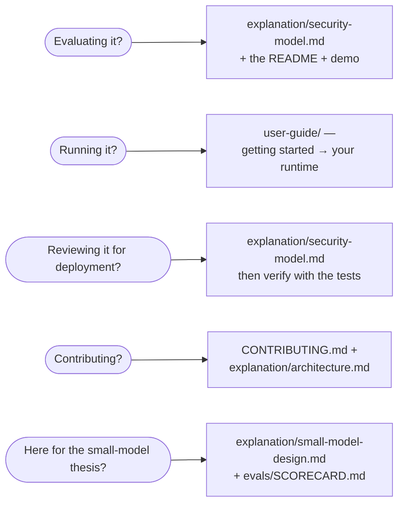

# f0_sectools documentation

Start from who you are:

## Understand it (explanation)

- **[Architecture](explanation/architecture.md)** — shared core + thin
  servers, the anatomy of a tool call, and the design decisions behind them.
- **[Security model](explanation/security-model.md)** — the trust story:
  threat model, gated writes, redaction, credential isolation, audit. Read
  this before deploying; written for the person who approves it.
- **[The findings schema](explanation/findings-schema.md)** — the single
  output contract, its lifecycle, and the persona renderers.
- **[Small-model design](explanation/small-model-design.md)** — why every
  tool is flat, bounded, and few; and the eval loop that keeps it measurable.
- **[Design history](explanation/design-history.md)** — the dated plan/spec
  archive (`superpowers/`) indexed as an ADR log.

## Run it (guides)

- **[User Guide](user-guide/README.md)** — setup, per-runtime guides (Hermes,
  pi, opencode, Claude Code, LM Studio, Open WebUI), skills & personas,
  workflows, prompting, troubleshooting.
- **[Running with local models](running-with-local-models.md)** — serving a
  tool-calling model with vLLM / llama.cpp.
- **[Runtime performance](runtime-performance.md)** — choosing a serving
  stack and model: Ollama vs vLLM vs llama.cpp benchmarks.
- **[Demo](demo.md)** — a full tool call end-to-end, offline, in 30 seconds.

## Look it up (reference)

- **[Tool reference](reference/tools/README.md)** — all 51 tools across the
  8 servers: descriptions, parameters, enums, defaults, gated-write badges.
  *Generated from the live tool registries; CI fails if it drifts.*
- **[Skills catalog](reference/skills.md)** — all 25 portable skills, by
  platform. *Generated from `SKILL.md` frontmatter.*
- **[Glossary](reference/glossary.md)** — every term, defined once.
- **[Eval scorecard](../evals/SCORECARD.md)** — measured model × server
  callability matrix; [agentic eval](../evals/AGENTIC.md) for multi-step runs.
- Credentials & permissions per platform: each server's README under
  [`servers/`](../servers/README.md) and its `.env.<platform>.example`.

## House rules & history

- [CLAUDE.md](../CLAUDE.md) — the build guide and critical rules for agents
  (and humans) working *on* this repo.
- [proposals/](proposals/2026-07-22-documentation-overhaul.md) — accepted
  documentation plans.
