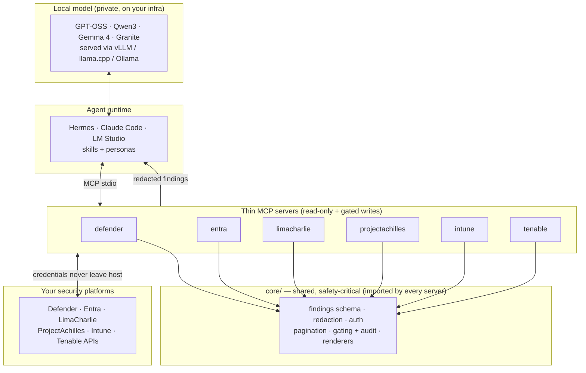

# Architecture

f0_sectools is a **shared core library + thin per-platform servers**. All
cross-cutting and safety-critical logic lives once in `core/`; each server is a
thin adapter that knows only its platform's API and tool definitions and imports
everything else — findings schema, redaction, auth, pagination, gating, persona
renderers — from `core/`. The safety guarantees are therefore enforceable in one
auditable place and cannot drift across integrations.

Every tool returns the normalized [findings schema](../CLAUDE.md#the-findings-schema);
output is redacted at the server boundary before it reaches the runtime. See
[CLAUDE.md](../CLAUDE.md) for the full house rules.
