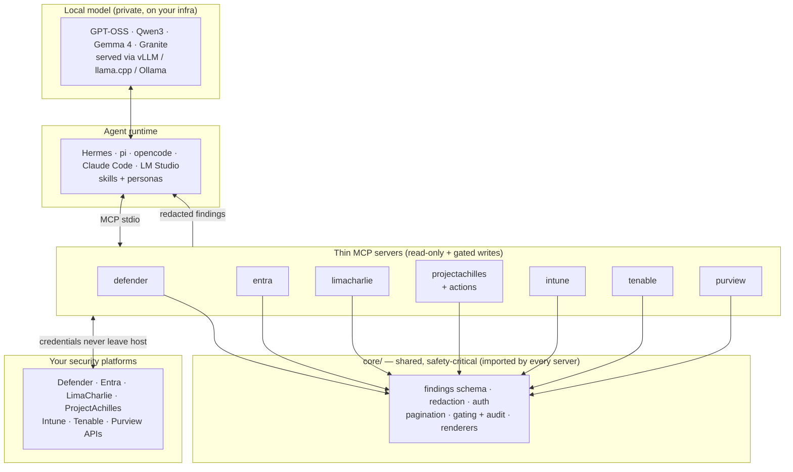
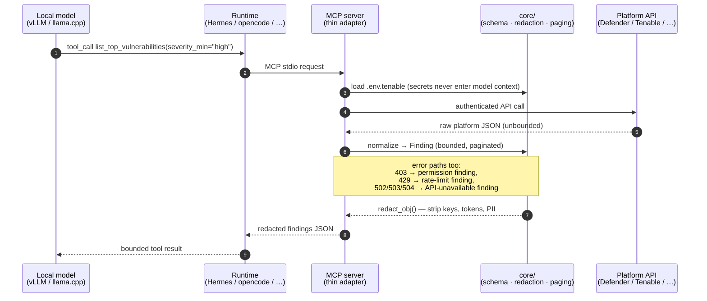
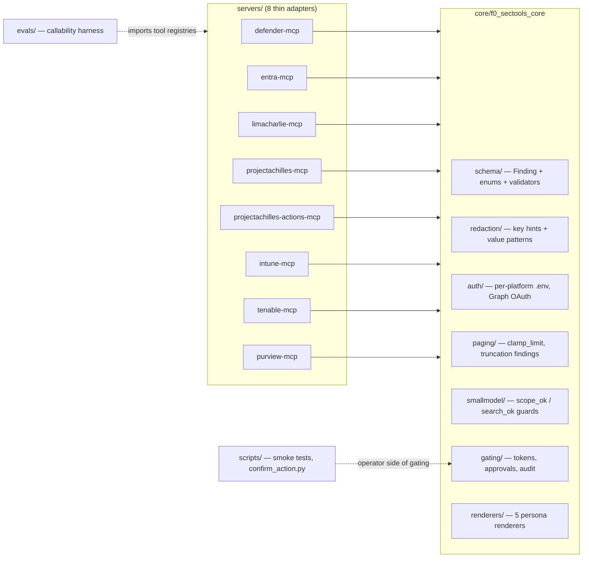

# Architecture

*Explanation — why f0_sectools is built the way it is. For setup, see the
[User Guide](../user-guide/README.md); for the trust story, see the
[security model](security-model.md).*

f0_sectools is a **shared core library + thin per-platform MCP servers**. All
cross-cutting and safety-critical logic lives once in `core/`; each server is a
thin adapter that knows only its platform's API and its tool definitions, and
imports everything else — findings schema, redaction, auth, pagination, gating,
persona renderers — from `core/`. The safety guarantees are therefore
enforceable in **one auditable place** and cannot drift across integrations.

Two constraints drive every decision:

1. **Privacy** — security-operations data and credentials never leave the
   operator's infrastructure. Everything runs locally against a small
   open-weight model (GPT-OSS, Qwen3, Gemma 4) served via vLLM or llama.cpp.
2. **Small-model callability** — tools must be reliably drivable by a ~4–20B
   parameter model at 8-bit quant. That rules out sprawling tool registries,
   nested argument schemas, and unbounded output. See
   [small-model design](small-model-design.md).

## System context



The model never talks to a platform. The runtime never sees a credential. The
platform never sees the model. Each hop narrows what can flow across it.

## Anatomy of a tool call

Where each guarantee physically sits — one read call, end to end:



Three things to notice:

- **Credentials load inside the server process** (`core/auth/`, per-platform
  `.env.<platform>` with a distinct env prefix). They are used to make the API
  call and never appear in any return path.
- **Every failure becomes a finding, never an exception.** A 403 becomes a
  `posture` finding naming the exact permission to grant; a sustained 429
  becomes a rate-limit finding; a gateway error becomes an "API unavailable"
  finding. A partially configured tenant produces actionable guidance instead
  of stack traces (which could also leak platform internals).
- **Redaction is the last hop before output** — `redact_obj()` is applied at
  the server boundary to the serialized finding, including error paths. See
  the [security model](security-model.md#redaction).

## The shared core



The rule, stated as edges: **servers depend on core; nothing else.** There are
no server→server edges (cross-platform correlation happens in *skills*, at the
agent layer — not in code). No server re-implements a core concern; that is
[Critical Rule 6](../../CLAUDE.md#critical-rules-never-violate), and it is what
makes the guarantees auditable — reviewing `core/` reviews the safety posture
of all eight integrations at once.

What each core package owns:

| Package | Owns | Key facts |
|---|---|---|
| `schema/` | The [findings schema](findings-schema.md) — the single output contract | Pydantic models; builders for permission/throttle/outage findings |
| `redaction/` | Stripping secrets/PII from every return path | Key-hint match (`secret`, `token`, `apikey`, …) + value patterns (Bearer, JWT, key-shaped strings); replaces with `«redacted»` |
| `auth/` | Per-platform credential loading + Microsoft Graph OAuth | Distinct env prefix per platform; missing vars fail fast; secrets never logged |
| `paging/` | Bounded output | Default page 25, hard max 100 (`clamp_limit`); truncation emits a "more available" finding so the model stops re-querying |
| `smallmodel/` | Shared input-validation predicates | `scope_ok` (strict, 1–128 chars, bounded charset — gated-write targets), `search_ok` (permissive read-side bound) |
| `gating/` | The write-action hard stop + audit trail | Flag + single-use out-of-band confirmation; see [security model](security-model.md#gated-write-actions) |
| `renderers/` | Persona-shaped Markdown views of findings | Deterministic, model-free; output re-redacted as defense in depth |

## The server pattern

Every server is the same five files — by design, so the recipe in
[CONTRIBUTING.md](../../CONTRIBUTING.md) is genuinely repeatable:

```
servers/<platform>-mcp/
  f0_<platform>_mcp/
    client.py    # thin async wrapper over the platform API (httpx, or a
                 # vendor SDK wrapped in asyncio.to_thread if synchronous)
    errors.py    # map_<platform>_error(): auth/403/429/5xx → posture findings
    tools.py     # ≤ ~8 flat read tools returning list[Finding]
    server.py    # FastMCP registration; redact_obj() at the boundary
  .env.<platform>.example   # exact required permissions/scopes, documented
  tests/                    # contract tests against a fake client
```

Three auth models are proven without any `core/` change: Microsoft Graph OAuth
client-credentials (Defender, Entra, Intune, Purview), a synchronous vendor SDK
(LimaCharlie), and a static Bearer REST key (ProjectAchilles, Tenable's
`X-ApiKeys`).

## Layers above the servers

- **Skills** (`skills/`) — 25 portable [agentskills.io](https://agentskills.io)
  playbooks that orchestrate the tools (triage an incident, review posture,
  close the offensive↔defensive loop). One set, no per-runtime forks.
- **Personas** — four role lenses (CISO, threat hunter, detection engineer,
  security engineer) shaping which tools/skills the agent favours and how it
  frames output. Distinct from `core/renderers/`, which shapes a *finding's
  text*; the two compose.
- **Runtimes** (`integrations/`, `prompts/`) — wiring only, never content:
  Hermes config + installable profile, pi templates, in-repo opencode wiring,
  and a portable system prompt for non-skill UIs.

## Design decisions (and their trade-offs)

- **Single shared-core workspace, not published per-server packages.** One
  `uv sync --all-packages` installs everything editable; safety fixes land in
  every server atomically. If servers ever ship individually, we graduate to a
  packages layout then — not before (YAGNI).
- **Thin servers even when a rich vendor SDK exists.** The official
  LimaCharlie MCP server exposes 278 tools and optional cloud LLM calls —
  capability-maximal, and incompatible with the small-model + local-only +
  read-only-gated thesis. We deliberately expose 6 curated tools instead.
- **Findings, not raw JSON.** Normalization costs fidelity (a finding is a
  summary, not the full platform record) but buys chainability: any skill can
  consume any server's output, and the model parses one shape, always.
- **Cross-platform logic in skills, not code.** Correlation playbooks stay
  editable prose; the code dependency graph stays a star.

## Where the history lives

Every significant design here was planned and specced before it was built.
The dated documents in [`docs/superpowers/`](../superpowers/) are the de-facto
ADR log — indexed in [design history](design-history.md).
