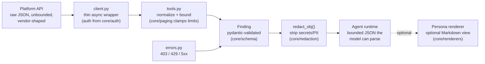

# The findings schema

*Explanation + reference — the single output contract every f0_sectools tool
returns, why it exists, and how a finding travels from a platform API to a
persona-shaped summary. Source of truth:
[`core/f0_sectools_core/schema/findings.py`](../../core/f0_sectools_core/schema/findings.py).*

## Why one schema

Security platforms disagree about everything — field names, severity scales,
pagination, error shapes. An agent gluing them together would need per-platform
parsing logic, and a **small local model** would need to hold eight mental
models at once. Instead, every tool — all 51, across all eight servers —
returns the same flat, predictable shape. The model parses one structure,
always; skills chain results across platforms without translation; and
human-facing views are *rendered from* the data rather than being the data.

## Lifecycle of a finding



Error paths join the same pipeline: a 403 becomes a `posture` finding naming
the permission to grant (`Finding.permission_missing`), a sustained 429 a
rate-limit finding (`Finding.rate_limited`), a gateway failure an
"API unavailable" finding (`Finding.api_unavailable`). **Every failure becomes
a finding, never an exception** — so a partially configured tenant degrades to
actionable guidance, and stack traces (a leak vector) never reach the model.

## The schema

```jsonc
{
  "schema_version": "1.0",
  "source": "tenable",               // which platform produced this
  "finding_type": "misconfig",       // see enum below
  "severity": "critical",            // info | low | medium | high | critical
  "title": "Tenable: Apache Log4j RCE (Log4Shell) (plugin 155999)",
  "entity": {                        // what this is about (optional)
    "kind": "rule",                  // see EntityKind below
    "id": "155999",
    "name": "Apache Log4j Remote Code Execution (Log4Shell)"
  },
  "evidence": [                      // bounded, redacted supporting facts
    { "key": "affected_hosts", "value": "12" },
    { "key": "cvss", "value": "10.0" }
  ],
  "recommended_action": {            // optional
    "summary": "Review affected hosts and remediate.",
    "gated_action": null,            // tool name if a gated write applies
    "confidence": "medium"
  },
  "references": [                    // MITRE ATT&CK, vendor KBs, source IDs
    { "type": "tenable_plugin", "id": "155999", "url": null }
  ],
  "observed_at": "2026-06-28T10:00:00Z"   // optional ISO timestamp
}
```

### Fields

| Field | Type | Notes |
|---|---|---|
| `schema_version` | str | `"1.0"` today; bump on breaking change |
| `source` | str | platform slug: `defender`, `entra`, `limacharlie`, `projectachilles`, `intune`, `tenable`, `purview` |
| `finding_type` | enum | `alert` · `incident` · `misconfig` · `risk` · `ioc` · `posture` · `hunt_result` · `action` |
| `severity` | enum | `info` · `low` · `medium` · `high` · `critical` |
| `title` | str | one human-readable sentence; the model's primary summary cue |
| `entity` | object? | `kind` ∈ `host` · `user` · `file` · `ip` · `account` · `app` · `service_principal` · `role` · `policy` · `rule` · `tenant` · `device`, plus `id` and optional `name` |
| `evidence` | list | flat `{key, value}` string pairs — bounded, never nested |
| `recommended_action` | object? | `summary`, optional `gated_action` (the tool that could act), `confidence` |
| `references` | list | `{type, id, url?}` — MITRE techniques, vendor plugin/KB ids |
| `observed_at` | str? | ISO-8601 when the platform observed it (not when we fetched it) |

### Finding types, in practice

- **`alert` / `incident`** — detections from the platform (Defender alerts,
  LimaCharlie detections, DLP alerts).
- **`misconfig`** — a fixable configuration/exposure problem (a vulnerability,
  a stale device, a permissive CA policy).
- **`risk`** — a scored risk statement about an entity (risky user, weak
  technique).
- **`ioc`** — an indicator observed in telemetry.
- **`posture`** — an environment-level statement: scores, coverage summaries —
  and all graceful degradations (missing permission, throttled, API down,
  "more results available").
- **`hunt_result`** — a row-set summary from a guided or custom hunt.
- **`action`** — the gated-write vocabulary: the *intent* a write tool returns
  before confirmation, and the executed result after. See the
  [security model](security-model.md#gated-write-actions).

## Design rules the schema encodes

- **Flat evidence, string values.** `{key, value}` pairs rather than nested
  vendor objects — a small model can quote them without misparsing, and the
  redaction layer can sweep them wholesale.
- **Bounded lists.** Tools clamp page sizes (default 25, max 100 —
  `core/paging`) and emit an explicit `posture` finding when results were
  truncated, so the model narrows its filter instead of re-dumping.
- **The severity enum is closed and five-valued.** Every platform's scale maps
  into it; the model never sees `P3` from one tool and `Sev2` from another.
- **`recommended_action.gated_action` is the only bridge to writes.** A read
  finding may *name* the gated tool that could respond; invoking it still
  walks the full [gate](security-model.md#gated-write-actions).

## Persona renderers (`core/renderers/`)

The same finding renders differently per audience — deterministic, model-free
string building (same input, same output, no LLM in the loop), re-redacted as
defense in depth:

| Persona | Lens |
|---|---|
| `soc_analyst` | per-incident, tactical: what happened, evidence, next triage step |
| `security_engineer` | config-level: the misconfig/coverage gap and the fix |
| `ciso` | aggregated rollups, severity mix, exec framing |
| `threat_hunter` | timeline-and-pivot framing for case building |
| `detection_engineer` | grouped by ATT&CK technique; unmapped findings flagged |

Two persona layers, don't confuse them: these renderers shape a *finding's
text*; the **agent personas** (CISO / threat hunter / detection engineer /
security engineer in `integrations/` and `prompts/`) shape the *agent's
behaviour*. They compose — renderer output is optional polish, the agent
persona is the primary mechanism.

## Extending the schema

Adding a field is a minor version (additive, defaults preserved); removing or
re-typing one is a breaking change and bumps `schema_version`. Before adding,
ask: can it live in `evidence` as a `{key, value}` pair instead? (It usually
can, and that keeps every consumer working unchanged.) Enum additions
(`EntityKind`, `FindingType`) are additive but must stay short — a 40-value
enum is a small-model design defect (Critical Rule 5).
