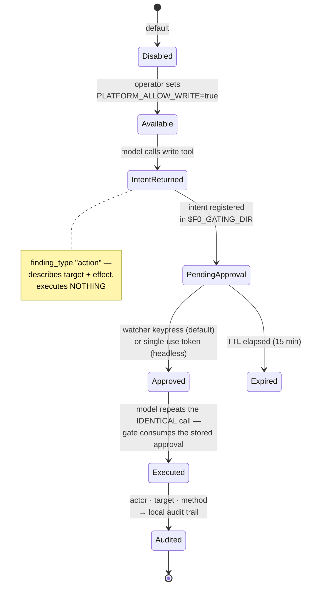

# Security model

*Explanation — what an AI agent wired to your security platforms through
f0_sectools can and cannot do, what stops it, and what is on the record
afterwards. Written for the person who has to approve a deployment.*

## Summary

- **Read-only by default.** Every platform query is read-only. Of the 51
  registered tools, only six can change anything (Defender
  `isolate_host`/`release_host`; ProjectAchilles `run_test`, `schedule_test`,
  `set_schedule_status`, `cancel_tasks`) — and each is disabled until an
  operator sets a per-platform write flag, and then still requires a
  **per-action human confirmation** the model cannot forge.
- **Secrets never reach the model.** Credentials live in per-platform `.env`
  files, are loaded inside the server process, and appear in no return path.
  All output — including errors — is redacted before the agent sees it.
- **Nothing leaves the host.** No telemetry, no analytics, no cloud API. The
  only outbound calls are to the security platforms you configured.
- **Every write is audited** locally: action, target, actor, method, and a
  hash-reference of the confirmation that authorized it.

## Threat model

The design assumes four things can go wrong:

| # | Threat | Primary defense |
|---|---|---|
| T1 | **A misaligned, jailbroken, or simply confused local model** tries to take a destructive action (isolate a host, cancel a fleet's tasks) or is manipulated into trying | Gated writes: flag + out-of-band human confirmation ([below](#gated-write-actions)) |
| T2 | **Prompt injection via platform data.** Alert titles, file names, and log fields are attacker-influenced text that flows into model context | Read-only default limits blast radius to *bad analysis*; any resulting write attempt still hits the T1 gate; bounded output limits exposure |
| T3 | **Credential leakage** into model context, logs, chat transcripts, or upstream model APIs | Credential isolation + centralized redaction ([below](#secrets-and-redaction)) |
| T4 | **Data exfiltration / oversharing** of sensitive security data | Local-only operation (local model, local runtime); bounded, summarized, redacted output |

Out of scope — things f0_sectools cannot protect you from: a compromised host
it runs on (an attacker with local root has your `.env` files regardless), a
malicious operator (the human who holds the approval keys), and the security
platforms themselves.

## Gated write actions

The single hard stop for every state-changing tool is `core/gating/` —
implemented once, used by every server, and covered by contract tests that
verify refusal without a flag and without a valid confirmation.

The rule, in one sentence: **execution requires BOTH an operator-set config
flag AND a fresh per-action human confirmation, delivered on a channel the
model cannot read.**

### Layer 1 — the write flag

Each platform's write tools are absent-in-effect until the operator sets, e.g.,
`DEFENDER_ALLOW_WRITE=true` in `.env.defender`. Without it, a write call
returns a refusal finding. This is a deliberate two-key design: enabling
writes is a *deployment* decision (the flag), while executing one is an
*operational* decision (the confirmation) — neither alone suffices.

### Layer 2 — human confirmation (three surfaces)

**Watcher (default).** The model's first call returns an *intent* finding and
registers a pending request under `$F0_GATING_DIR` (default
`~/.f0sectools/gating/`). The operator runs
`python scripts/confirm_action.py --watch` in their own terminal and approves
with a keypress. The agent then repeats the *identical* call; the gate consumes
the stored approval. **No token ever enters model context** — there is nothing
for the model to fabricate, replay, or leak.

**Token (headless/scripted).** `confirm_action.py <action> "<target>"` prints a
single-use token the operator passes as `confirmation_token`. Properties, as
implemented in `core/gating/actions.py`:

- Only the **SHA-256 hash** of the token is persisted, bound to
  `(action, target, expires_at)`. Plaintext exists only in the operator's
  terminal and the single in-flight tool call.
- **Single-use by construction:** the store unlinks the record *before*
  validating it, so of two concurrent callers exactly one can win.
- **Target-bound:** a token issued for `isolate_host` on `web-01` authorizes
  nothing else.
- **TTL 15 minutes**, expired records swept on every access.

Both surfaces are **forge-resistant** and are the only modes permitted for
destructive or irreversible actions.

**Chat-confirm (opt-in, off by default, never for destructive actions).**
Enabled per platform via `<PLATFORM>_CONFIRM_MODE=chat` (today only the
ProjectAchilles actions server). The operator replies "approved" in chat and
the agent re-calls the tool echoing the intent's `confirmation_target` as the
token. This is convenient for supervised, *reversible* operations (running a
validation test) — and it is **honestly not forge-resistant**: the
"confirmation" is text the model can see and could fabricate. It is also not
single-use — while the flag is on, the echo authorizes every identical call,
so the operator must give a fresh "approved" before any re-call and the mode
suits supervised sessions only, never unattended operation. If in doubt, use
the watcher.

### Layer 3 — the audit trail

Every executed action appends a JSON line to `$F0_GATING_DIR/audit.log`:
`action`, `target`, `actor`, `method` (`token` / `approval` / `chat-confirm`),
and `token_ref` — a 16-hex-char hash reference linking the execution to the
confirmation that authorized it without storing the credential itself. The
trail is local; it is never shipped anywhere.

### The boundary condition

The gate's guarantee holds only when `confirm_action.py` runs in a terminal
**the model cannot drive**. In runtimes where the model has shell access
(Claude Code, opencode), treat the approval CLI — especially `--approve` — as
operator-only, and keep write flags off unless you are supervising. This
limitation is by design and stated rather than papered over.

## Secrets and redaction

**Isolation.** Each platform reads its own `.env.<platform>` through a distinct
env prefix (`DEFENDER_*`, `ENTRA_*`, …) via `core/auth/`. A server can only
load its own platform's credentials; there is no shared credential store to
bleed across. All `.env*` files are gitignored, and CI runs gitleaks on every
push.

**Redaction.** Every value returned to the agent passes through
`core/redaction/` at the server boundary — the serialized finding, including
error messages. Two mechanisms:

- **Key hints:** any dict key containing `secret`, `password`, `token`,
  `authorization`, `api_key`, `private_key`, `credentials`, `cookie`, … (snake_case
  and camelCase both matched) has its value replaced with `«redacted»`.
- **Value patterns:** strings matching `Bearer …`, JWT (`eyJ…`), or long
  key-shaped tokens are replaced wherever they appear, regardless of key.

Persona renderers re-apply text redaction to their output as defense in depth.
Contract tests assert redaction on success *and* error paths for every server.

**What redaction is not:** a DLP system. It targets credentials and
token-shaped material. Findings still contain the operational security data you
asked for (hostnames, usernames, alert titles) — that is the product. The
privacy guarantee for that data is architectural: it flows only to *your* local
model on *your* infrastructure.

## Bounded output as a safety property

Unbounded platform dumps are not just a context-window problem — degraded
context silently degrades tool-calling accuracy, which is how a confused model
starts doing the wrong thing (T1/T2). `core/paging/` therefore clamps every
page size (default 25, hard max 100) and emits an explicit "more available"
finding on truncation so the model narrows instead of re-querying. Write-target
arguments are additionally validated by strict bounded-charset checks
(`core/smallmodel/scope_ok`, 1–128 chars) before they ever reach a gate.

## What runs where

| Component | Runs on | Sees credentials | Sees model output | Reachable from network |
|---|---|---|---|---|
| Local model (vLLM/llama.cpp) | your GPU box | no | is the model | your choice (LAN) |
| Agent runtime (Hermes, …) | your workstation | no | yes | no |
| MCP servers (this repo) | your workstation (stdio child of the runtime) | **yes — only its own platform's** | no (they only see tool calls) | no — stdio only |
| `confirm_action.py` watcher | operator's own terminal | no | no | no |
| Security platforms | vendor cloud / your infra | n/a | no | already exposed to you |

## Verifying the claims yourself

- `uv run pytest` — contract tests include: gate refuses without flag; gate
  refuses without confirmation; redaction strips secrets on success and error
  paths; pagination bounds hold under large mocked result sets.
- `uv run python scripts/demo_mock_findings.py` — a full tool call offline;
  inspect the redacted output shape.
- Read one file: [`core/f0_sectools_core/gating/actions.py`](../../core/f0_sectools_core/gating/actions.py)
  (~290 lines) is the entire write-path authority.
- Design history: [gating approvals](../superpowers/specs/2026-07-18-gating-approvals-design.md),
  [chat-confirm](../superpowers/specs/2026-07-19-gating-chat-confirm-design.md),
  [small-model safety hardening](../superpowers/specs/2026-07-19-small-model-safety-hardening-design.md).

## Reporting

Found a weakness in any of the above? See [SECURITY.md](../../SECURITY.md) for
how to report it privately.
