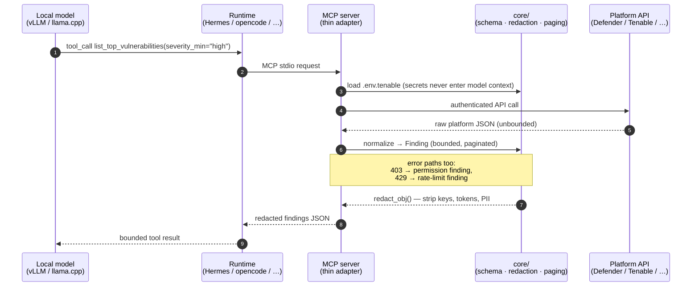
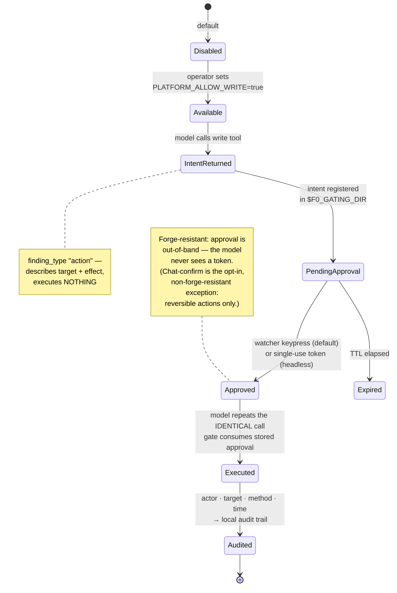

# Proposal: Documentation Overhaul

**Date:** 2026-07-22 · **Status:** Proposed · **Scope:** all user-facing and contributor-facing documentation

---

## 1. Executive summary

f0_sectools has grown into a real product: **8 live-validated MCP servers, 51 registered
tools, 25 portable skills, 6 supported runtimes, a small-model eval harness with a
published scorecard, and a forge-resistant write-gating system** that is genuinely novel.
The documentation has not kept pace. It is good where it exists (the README, the runtime
guides, the prompting guide) but it is **uneven, drifting out of date, and missing the
documents that would let a stranger evaluate, adopt, and extend the project**.

Three symptoms found during the audit make the case concretely:

- The README says *"Seven MCP servers … 45 registered tools … 22 portable skills."*
  The repo actually contains **eight servers, 51 tools, and 25 skills** — Purview is
  missing from the README's flagship table entirely.
- `servers/README.md` still lists `defender-mcp` and `entra-mcp` as **"Planned"** —
  they have been built and live-validated for weeks.
- The single most differentiating design in the project — the **forge-resistant gated
  write system** — has no user-facing document. It lives only inside CLAUDE.md, a file
  addressed to coding agents, not to the security engineers who must trust it.

This proposal delivers four things:

1. **An audit** of every existing document (§3) with a gap analysis (§4).
2. **A target information architecture** (§5–§6) organized on Diátaxis lines
   (tutorials / how-to / reference / explanation), with a per-document purpose,
   audience, and outline — including a full **architecture diagram set** (§7) with
   ready-to-lift Mermaid sources.
3. **A drift-prevention strategy** (§8): the numbers above went stale because they are
   hand-maintained. The tool reference, skills catalog, and support matrix should be
   **generated from code** and guarded by CI, exactly like `integrations/
   test_integrations_valid.py` already guards the runtime templates.
4. **A phased roadmap** (§11) sized so each phase is independently shippable, plus a
   list of **quick fixes** (§10) that should land regardless of what else is approved.

The guiding idea throughout: **apply the project's own thesis to its docs.** We build
tools that small models can reliably drive — flat, bounded, discoverable, drift-guarded.
The documentation should be built the same way for humans: one source of truth per fact,
bounded pages with clear entry points, and CI that fails when docs and code disagree.

---

## 2. Audiences

Every proposed document names its audience. There are five, with very different needs:

| Audience | They ask | Today they get |
|---|---|---|
| **Evaluator** (security lead deciding whether to try this) | "What is it? Can I trust it? What's the security model?" | README + scattered CLAUDE.md fragments |
| **Operator** (SOC analyst / engineer running it) | "How do I set it up with my runtime and platforms?" | Good: `docs/user-guide/` |
| **Security reviewer** (person who must approve deployment) | "Threat model? What can the model do? What's audited?" | **Nothing user-facing** |
| **Contributor** (adding a platform server or skill) | "What's the pattern? What are the rules?" | CLAUDE.md (agent-facing) + thin CONTRIBUTING.md |
| **Local-AI builder** (cares about the small-model design) | "Why do these tools work with a 20b model? Evidence?" | README §differentiator + evals/SCORECARD.md |

The security reviewer is the most underserved audience today, and the one whose sign-off
gates every enterprise adoption.

---

## 3. Audit — what exists today

Roughly **1,900 lines** of operator docs plus component READMEs. Inventory with verdicts:

| Document | Lines | Verdict |
|---|---|---|
| `README.md` | 181 | **Strong** front door; stale numbers (7→8 servers, 45→51 tools, 22→25 skills; Purview row missing) |
| `CLAUDE.md` | 386 | Excellent content, wrong audience — it is the de-facto architecture doc but addressed to coding agents; users are told "see CLAUDE.md" for the findings schema, gating, and design rules |
| `docs/README.md` | 9 | **Stub.** No documentation hub exists |
| `docs/architecture.md` | 42 | One diagram (near-duplicate of the README's) + two paragraphs. Far too thin for a system with this much deliberate design |
| `docs/user-guide/README.md` | 80 | Good hub; **broken table** (Purview row separated from the platform table by a blank line, renders as a fragment) |
| `docs/user-guide/getting-started.md` | 79 | Good; slightly Microsoft-centric examples |
| `docs/user-guide/runtimes/*.md` (6) | 44–198 | Good-to-excellent; the Hermes and pi guides are the best docs in the repo |
| `docs/user-guide/workflows.md` | 275 | Good; text-only, no sample transcripts/output |
| `docs/user-guide/prompting.md` | 91 | Excellent, unique content |
| `docs/user-guide/troubleshooting.md` | 64 | Useful, thin; will grow |
| `docs/user-guide/using-skills-and-personas.md` | 56 | OK; no catalog of the 25 skills |
| `docs/running-with-local-models.md` | 91 | Good |
| `docs/runtime-performance.md` | 168 | Excellent, unique content |
| `docs/demo.md` | 58 | Good seed; only one demo |
| `docs/superpowers/` (26 plans + 26 specs) | ~large | **Gold mine, undiscoverable.** The full design history (gating design, small-model hardening, per-server designs) with zero index or pointer from anywhere |
| `servers/README.md` | 17 | **Stale:** lists built servers as "Planned" |
| `servers/*/README.md` (8) | 13–88 | **Very uneven:** intune 13 lines, pa-actions 88. No shared template |
| `skills/README.md` | ~60 | Good format doc; no catalog |
| `evals/README.md`, `SCORECARD.md`, `AGENTIC.md` | ~250 | Good; scorecard partially stale (notes pending passes) |
| `examples/` | 4 files | **Nearly empty:** three MCP config JSONs + README. No transcripts, no sample findings, no persona output comparisons |
| `CONTRIBUTING.md` | 52 | Correct but thin; the real recipe (12 steps) lives only in CLAUDE.md |
| `SECURITY.md`, `CODE_OF_CONDUCT.md`, `CHANGELOG.md`, `NOTICE` | — | Present, adequate |

**What's genuinely good and must be preserved:** the README's voice and structure, the
per-runtime guides, prompting.md, runtime-performance.md, and the discipline of
`.env.<platform>.example` files documenting exact permissions.

---

## 4. Gap analysis

Ordered by impact:

1. **No security model document.** The project's trust story — read-only default,
   forge-resistant gating, the honest chat-confirm caveat, redaction, credential
   isolation, audit trail — is the #1 adoption question and lives only in CLAUDE.md.
   A security reviewer should never be sent to a file addressed to Claude.
2. **No tool reference.** 51 tools, each with a carefully written small-model
   description, argument enums, and defaults — and no page listing them. Operators
   discover tools by reading source or asking the model.
3. **Hand-maintained counts drift.** Servers/tools/skills counts appear in ≥4 places
   (README, user-guide matrix, CLAUDE.md, servers/README) and are wrong in at least
   three today. Facts that CI can compute must not be hand-typed.
4. **Architecture doc is a placeholder.** No sequence diagram of a tool call through
   the redaction boundary, no gating state machine, no findings lifecycle, no package
   dependency map — for a project whose *architecture is the product*.
5. **No skills catalog.** 25 skills with names, descriptions, and versions in
   frontmatter; no generated index. CLAUDE.md hand-lists them in a paragraph (already
   drifted: says 22).
6. **`examples/` is a missed opportunity.** The mock-findings demo proves the concept
   in 30 seconds; there should be one such artifact per major claim (a triage
   transcript, a gated-write approval session, a persona render comparison).
7. **No FAQ / no glossary.** Recurring concepts (finding, gated action, watcher,
   chat-confirm, persona vs. renderer, callability, live-validated) are defined
   inline, differently, in several places.
8. **CLAUDE.md is overloaded.** It is simultaneously: agent instructions, architecture
   reference, security policy, contribution recipe, and platform matrix. Everything
   user-relevant should move to `docs/` with CLAUDE.md linking to it (single source of
   truth), keeping only the agent-specific rules inline.
9. **Design history is invisible.** 52 plan/spec documents that answer "why is it
   built this way?" with no index — effectively private ADRs.
10. **Server READMEs lack a template.** A newcomer comparing `intune-mcp` (13 lines)
    to `projectachilles-actions-mcp` (88 lines) can't tell what a "done" server README
    contains.

---

## 5. Guiding principles for the new docs

1. **Diátaxis separation.** Tutorials (getting started, demos), how-to guides
   (runtimes, workflows), reference (tools, skills, schema, config), explanation
   (architecture, security model, small-model design). Pages state which they are and
   don't mix modes.
2. **One source of truth per fact.** Every fact lives in exactly one authored place —
   or in code, from which docs are generated. Everything else links.
3. **Generated where possible, drift-guarded always.** Tool reference and skills
   catalog are generated from code/frontmatter; a CI test fails when the committed
   output is stale (same pattern as `integrations/test_integrations_valid.py`).
4. **Every claim has a runnable artifact.** "Redaction is mandatory" → a demo that
   shows a secret being stripped. "A model can't isolate a host alone" → a transcript
   of the gate refusing. `scripts/demo_mock_findings.py` is the model to replicate.
5. **CLAUDE.md becomes a pointer, not a mirror.** Agent rules stay; shared content
   (schema, gating, platform matrix, recipe) moves to docs and is linked. This is
   Critical Rule 6 (safety logic lives in one place) applied to prose.
6. **Bounded pages.** Target ≤300 lines per page; split rather than scroll. Small
   models get paginated output; humans get focused pages.

---

## 6. Target information architecture

```
README.md                        # front door (trimmed: counts become generated badges/links)
CONTRIBUTING.md                  # expanded: full recipe moves here from CLAUDE.md
CLAUDE.md                        # agent rules + pointers (deduplicated)

docs/
  README.md                      # ★ REAL documentation hub: audience-based entry points
  quickstart.md                  # ★ 10-minute path: clone → mock demo → one live platform
  demo.md                        # grows into a demo INDEX (see examples/)

  explanation/                   # ★ NEW — "why it's built this way"
    architecture.md              #   rewritten: layers, diagrams D1–D5, design decisions
    security-model.md            #   ★ the trust story: threat model, gating, redaction,
                                 #     credential isolation, audit, chat-confirm caveat
    findings-schema.md           #   ★ schema reference + lifecycle + persona renderers
    small-model-design.md        #   ★ the thesis: design rules + evidence from evals
    design-history.md            #   ★ index of docs/superpowers/ plans & specs (ADR log)

  reference/                     # ★ NEW — generated + authored reference
    tools/                       #   ★ GENERATED: one page per server (51 tools), from
      README.md                  #     FastMCP registry (names, args, enums, defaults,
      defender.md … purview.md   #     descriptions, gated flags)
    skills.md                    #   ★ GENERATED: catalog of 25 skills from frontmatter
    configuration.md             #   ★ every env var per platform, write flags,
                                 #     F0_GATING_DIR, confirm modes (from .env examples)
    glossary.md                  #   ★ finding, gated action, watcher, chat-confirm,
                                 #     persona vs renderer, callability, live-validated…

  user-guide/                    # (unchanged shape — it works)
    README.md                    #   fix table; matrix rows become generated include
    getting-started.md           #   link to quickstart; de-Microsoft the examples
    runtimes/*.md                #   keep; add opencode parity where thin
    workflows.md                 #   each workflow links to a transcript in examples/
    prompting.md                 #   keep
    using-skills-and-personas.md #   link to generated skills catalog
    gated-actions.md             #   ★ operator how-to: enable a write flag, run the
                                 #     watcher, approve, read the audit log (walkthrough)
    troubleshooting.md           #   keep, grow
    faq.md                       #   ★ evaluator questions: licensing, privacy, model
                                 #     requirements, GPU sizing, "why not lc-mcp-server"

  running-with-local-models.md   # keep
  runtime-performance.md         # keep
  proposals/                     # this document
  superpowers/                   # keep (now indexed by design-history.md)

examples/                        # ★ EXPANDED — see §9
  mcp/                           #   keep (client configs)
  findings/                      #   ★ one redacted real-shaped finding per server (8 JSON)
  transcripts/                   #   ★ annotated sessions: triage, posture, gated write
  personas/                      #   ★ same finding rendered 4 ways (analyst/engineer/
                                 #     ciso/hunter) — proves the renderer claim

servers/README.md                # fixed + links to reference/tools/
servers/_TEMPLATE.md             # ★ server README template (§9.3)
scripts/gen_docs.py              # ★ generates reference/tools/, reference/skills.md,
                                 #   and the support-matrix fragment
docs/tests/test_docs_fresh.py    # ★ CI drift guard: regenerates and diffs
```

★ = new or substantially rewritten. Everything unstarred is kept as-is or lightly edited.

---

## 7. The architecture diagram set

Today there are two near-identical Mermaid diagrams in the whole repo. The system has at
least five distinct structures worth drawing. Sources below are ready to lift into
`docs/explanation/architecture.md` and `security-model.md` (rendered natively by GitHub).

### D1 — System context (exists; keep in README + architecture.md)

The current README flowchart. Keep, add Purview and the actions server.

### D2 — Anatomy of a tool call (sequence, with the redaction boundary)

The single most explanatory diagram the project can have — it shows *where* every safety
guarantee physically sits:



### D3 — Gated write action lifecycle (state machine)

Belongs in `security-model.md` and the operator how-to. Makes the forge-resistance
argument visual: the approval never transits model context.



### D4 — Findings lifecycle (data pipeline)

For `findings-schema.md`: raw platform JSON → client → tool normalization → `Finding` →
redaction → runtime → optional persona renderer. One horizontal flowchart, annotated
with which `core/` package owns each hop.

### D5 — Package dependency map

For `architecture.md` and CONTRIBUTING: `core/{schema,redaction,auth,paging,smallmodel,
gating,renderers}` at the center, 8 thin servers importing it, `evals/` and `scripts/`
at the edge, with the rule rendered visually: **no server → server edges, no server
re-implementing a core concern.**

### D6 — Docs map (in `docs/README.md`)

A small flowchart routing the five audiences (§2) to their entry points, so the hub is
navigable in one glance.

---

## 8. Generated reference + drift guards (the anti-staleness system)

The audit's stale numbers are structural, not sloppiness: hand-maintained inventories
always drift. Proposal:

### 8.1 `scripts/gen_docs.py`

One script, three outputs, all committed (so docs read fine on GitHub without a build):

1. **Tool reference** (`docs/reference/tools/<server>.md`) — imports each server module
   (same list `evals/run.py` already maintains in `SERVER_MODULES`), reads the FastMCP
   registry, and emits per tool: name, one-line description (already written for the
   model — perfect for humans), parameters with types/enums/defaults, gated-or-read
   badge, and the skill(s) that reference it. The docstrings in `server.py` are already
   documentation-quality (see `tenable`'s) — this is pure harvest, no new writing.
2. **Skills catalog** (`docs/reference/skills.md`) — walks `skills/*/*/SKILL.md`
   frontmatter (name, description, version, tags) and groups by platform, marking each
   platform's default-focus skill.
3. **Support-matrix fragment** — the servers × tools × status table included by
   README/user-guide, derived from workspace `[project.scripts]` entries (the same
   source `integrations/test_integrations_valid.py` trusts) + a small
   `docs/_data/platforms.yaml` for the human-authored columns (auth model, status).

### 8.2 `test_docs_fresh.py` (CI, hard gate)

Regenerates in a temp dir and diffs against the committed files. Add a server, tool, or
skill without regenerating → CI fails with "run `uv run python scripts/gen_docs.py`".
This is exactly the drift-guard pattern the repo already trusts for integration
templates, extended to prose. Combined with the existing `links` (lychee) workflow, the
docs get: no dead links, no stale inventories, by construction.

### 8.3 De-duplicating CLAUDE.md

After `findings-schema.md`, `security-model.md`, and the generated matrix exist,
CLAUDE.md's copies become links. CLAUDE.md keeps: the Critical Rules, small-model design
rules, the agent workflow (autonomous mode, push gating), and the 12-step recipe pointer.
It drops: the hand-maintained skill list, the platform table, and the schema example —
each replaced by one line + link. Net effect: CLAUDE.md gets *shorter* and stops being
a second place for facts to rot.

---

## 9. Examples, demos, and standardization

### 9.1 `examples/` expansion

Each flagship claim gets a runnable or readable artifact:

| Claim | Artifact |
|---|---|
| "Normalized findings, any platform" | `examples/findings/` — one redacted, real-shaped finding JSON per server (harvested from smoke-script output, hand-redacted) |
| "A small model drives a full triage" | `examples/transcripts/defender-triage.md` — annotated real session: user prompt → tool calls → findings → summary, with commentary on why the model picked each tool |
| "A model can never write alone" | `examples/transcripts/gated-run-test.md` — the intent finding, the watcher approval, the audited execution; plus the *refusal* path with the flag off |
| "One finding, four altitudes" | `examples/personas/` — the same brute-force finding rendered analyst / engineer / CISO / hunter, side by side |
| "It works offline in 30 seconds" | keep `scripts/demo_mock_findings.py`; add a second mock demo exercising pagination + a redaction catch (secret visibly stripped) |

`docs/demo.md` becomes the index of these.

### 9.2 Workflow guides gain transcripts

Each workflow in `workflows.md` links its matching transcript, so "posture summary"
isn't just a prompt suggestion — it's a prompt plus what actually happened.

### 9.3 `servers/_TEMPLATE.md`

Locks in the sections a server README must have (the best current ones already do most
of this): What it connects to · Tools (link to generated reference) · Required
credentials & exact permissions/scopes · Env vars · Gated actions (if any) · Live
validation status · Smoke test command · Known platform quirks. Then backfill the thin
ones (`intune-mcp` at 13 lines first). Add a checklist line to CONTRIBUTING's recipe.

### 9.4 CONTRIBUTING.md absorbs the recipe

The 12-step "Adding a New Platform Server" moves from CLAUDE.md into CONTRIBUTING.md
(human-facing home), with CLAUDE.md linking to it. Add the docs steps: regenerate
reference, fill the README template, add a transcript if the server introduces a new
capability class.

---

## 10. Quick fixes (do these regardless — all found during audit)

1. **README:** "Seven MCP servers" → eight; add the missing **Purview row** to the
   flagship table; "45 registered tools" → 51; "22 portable skills" → 25 (then all
   become generated, §8).
2. **`docs/user-guide/README.md`:** remove the blank line splitting the Purview row
   from the platforms table (renders broken today).
3. **`servers/README.md`:** built servers listed under "Planned" — replace with the
   actual built list + planned remainder.
4. **`evals/SCORECARD.md`:** the README references "34 tools registered at once" and
   pending scorecard passes; re-run or reword so the headline matches the current
   51-tool reality.
5. **CLAUDE.md skill count** ("22 committed symlinks", skill list paragraph) — refresh
   once, then delegate to the generated catalog.

---

## 11. Phased roadmap

Each phase ships independently and is worth having even if later phases never happen.

| Phase | Contents | Effort | Value |
|---|---|---|---|
| **0 — Quick fixes** | §10 items | hours | Stops active bleeding; README credibility |
| **1 — Trust & explanation** | `docs/README.md` hub (+D6) · `security-model.md` (+D3) · rewritten `architecture.md` (+D2, D4, D5) · `findings-schema.md` · `small-model-design.md` · glossary | ~2–3 days of writing | Unblocks the evaluator and security-reviewer audiences — the adoption gate |
| **2 — Generated reference** | `gen_docs.py` · `reference/tools/` · `reference/skills.md` · matrix fragment · `test_docs_fresh.py` CI gate · CLAUDE.md de-dup | ~1–2 days | 51 tools documented "for free"; drift becomes impossible |
| **3 — Examples & guides** | `examples/{findings,transcripts,personas}` · `gated-actions.md` how-to · `faq.md` · workflow transcripts · server README template + backfill | ~2–3 days | Every claim demonstrable; contributor bar defined |
| **4 — Docs site (optional)** | MkDocs Material over `docs/` (`mkdocs.yml` + a `docs` CI job publishing to GitHub Pages). Zero content changes — the IA in §6 is already site-shaped. Adds search, nav, and versioning when the repo goes public | ~1 day | Polish; defer until public launch. **YAGNI applies** — do not build before Phase 1–3 content exists |

Suggested order: 0 → 1 → 2 → 3 → 4. Phase 2 before 3 so the examples and template can
link into the generated reference.

## 12. Acceptance criteria

The overhaul is done when:

- [ ] A security reviewer can answer "what can the model do, and what stops it?" from
      `docs/explanation/security-model.md` alone, without opening CLAUDE.md or source.
- [ ] Every one of the 51 tools appears in a reference page with its arguments and
      description, and CI fails if a tool is added without regenerating.
- [ ] All 25 skills appear in a generated catalog; the hand-written lists are gone.
- [ ] Server/tool/skill counts appear in exactly one generated place; README quotes it.
- [ ] `docs/README.md` routes all five audiences (§2) in ≤ one screen.
- [ ] Every flagship claim in the README links to a runnable demo or a committed
      transcript/artifact under `examples/`.
- [ ] Every built server's README follows the template.
- [ ] CLAUDE.md contains no fact that also lives (authored) in `docs/` — only rules,
      workflow, and links.
- [ ] `links` (lychee) and `test_docs_fresh.py` both green in CI.

---

*Prepared as part of the documentation-overhaul initiative. Companion history: the
existing design plans and specs in [`docs/superpowers/`](../superpowers/), which Phase 1
indexes as the project's de-facto ADR log.*
