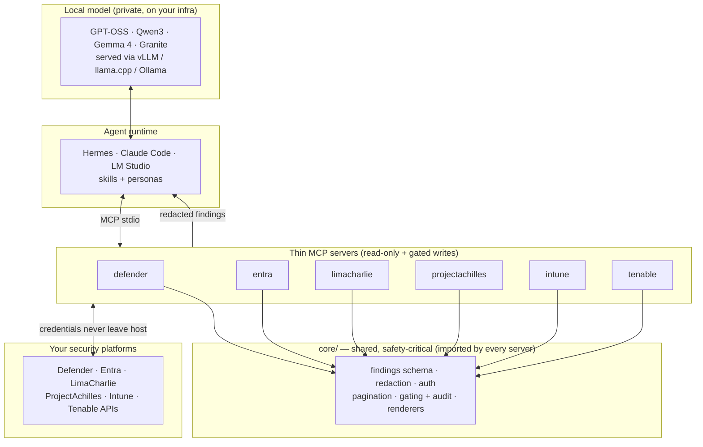

# f0_sectools v0.1.0 Public-Release Prep — Implementation Plan

> **For agentic workers:** REQUIRED SUB-SKILL: Use superpowers:subagent-driven-development (recommended) or superpowers:executing-plans to implement this plan task-by-task. Steps use checkbox (`- [ ]`) syntax for tracking.

**Goal:** Make the repo ready for a great `v0.1.0` public debut through documentation, community-health, and showcase polish — no shipped-code behaviour changes.

**Architecture:** Two reviewable PRs off `docs/release-prep-v0.1.0` (spec committed `67fba57`). **PR-1** (release docs): README rewrite, doc-drift sweep, SECURITY email, `.github` templates + Code of Conduct, `examples/mcp` content. **PR-2** (showcase): architecture diagram, mock/eval demo asset, CHANGELOG + version bump. The `v0.1.0` tag and the public flip are **user-gated** and out of scope.

**Tech Stack:** Markdown, Mermaid, Python 3.11+ (`uv`, `pytest`, `ruff`), MCP. Spec: `docs/superpowers/specs/2026-07-13-public-release-prep-design.md`.

## Global Constraints

- **Docs-only.** No changes to `core/` or any server's runtime behaviour. The only non-doc edit allowed is the `pyproject.toml` version bump in Task 7.
- **Every capability/status claim must trace to a real repo artifact** (a server test, a skill, a scorecard cell). No aspirational feature written present-tense.
- **Registered tool counts are fixed:** defender 6 (4 read + `isolate_host`/`release_host` gated), entra 4, limacharlie 6, projectachilles 6, intune 6, tenable 6 = **34 total**. These match `evals/SCORECARD.md`.
- **Scorecard headline (verbatim-safe):** every tested model scores 100%/100% per-server across all six platforms; the full 34-tool registry is driven at up to 100% (Qwen3.5). Source: `evals/SCORECARD.md`.
- **Repo URL:** `https://github.com/ubercylon8/f0_sectools`.
- **Security contact:** `security@fortika.io`.
- **No secrets staged.** After every commit, `git ls-files | grep -E '\.env'` must show only `*.example` files.
- **Every markdown link must resolve** (no dangling links to files created in a later PR — PR-1 must not link `docs/architecture.md`, which PR-2 creates).
- **Verification is not TDD.** Prose tasks verify with grep + link-check + `pytest`/`ruff` still green — not failing tests.
- **Commits:** Conventional Commits; stage specific files (never `git add -A`); trailers:
  ```
  Co-Authored-By: Claude Opus 4.8 <noreply@anthropic.com>
  Claude-Session: https://claude.ai/code/session_01Va1ncSUtqQJyetofn2mJem
  ```
- **Push is user-gated.** Do not push; `finishing-a-development-branch` presents options.

---

## ═══════════ PR-1 — Release docs & community health ═══════════

### Task 1: README rewrite

**Files:**
- Modify (full rewrite): `README.md`

**Interfaces:**
- Produces: the canonical front page. Tasks 5 (architecture) and 6 (demo) in PR-2 will *insert into* this README at marked anchors (`<!-- ARCH-DIAGRAM -->` and `<!-- DEMO -->`), so this task must leave those two HTML comment anchors in place.

- [ ] **Step 1: Replace `README.md` with the content below verbatim.**

````markdown
# f0_sectools — Security-Operations Tools & Skills for Local AI Agents

[](https://opensource.org/licenses/Apache-2.0)
[](https://www.python.org/)
[](https://github.com/ubercylon8/f0_sectools/actions/workflows/ci.yml)

**f0_sectools** connects AI agents to your security platforms — SIEM/XDR, EDR, identity, vulnerability management — so a **SOC analyst, security engineer, threat hunter, or CISO** can understand posture, assess risk, and decide the next action. It is built to run with **small, open-weight models on your own infrastructure** — no telemetry, no security data leaving the host, no frontier cloud API.

> **Naming:** `f0_sectools` is the software; **F0RT1KA** is the parent brand. It is part of the [ProjectAchilles](https://projectachilles.io/) ecosystem and the defensive counterpart to `f0_library` (offensive EDR detection testing).

## What works today

Six MCP servers, each **live-validated against a real tenant**, exposing read tools (and, for Defender, gated write actions):

| Server | Status | Tools | What it reads |
|---|---|---|---|
| `f0-defender-mcp` | ✅ live-validated | 6 (4 read + 2 gated) | secure score, incidents, alerts, hunting (KQL); gated `isolate_host` / `release_host` |
| `f0-entra-mcp` | ✅ live-validated | 4 | risky users, risk detections, conditional access, privileged roles |
| `f0-limacharlie-mcp` | ✅ live-validated | 6 | org overview, sensors, sensor detail, D&R rules, detections, LCQL telemetry |
| `f0-projectachilles-mcp` | ✅ live-validated | 6 | defense score, weak techniques, test executions, risk acceptances, agents, fleet health |
| `f0-intune-mcp` | ✅ live-validated | 6 | managed devices, compliance, stale devices, policies, config profiles |
| `f0-tenable-mcp` | ✅ live-validated | 6 | vuln summary, top vulns, assets, per-asset vulns, plugin info, scans |

**34 registered tools.** Plus a shared `core/` (findings schema, redaction, auth, pagination, gating, persona renderers), 20 portable [agentskills.io](https://agentskills.io) skills, four role personas, a Hermes integration, and a small-model eval harness.

## For security teams

- **Read-only by default.** Every platform query is read-only. Any state-changing action (isolate a host, disable a user, close an incident) is **gated** behind an explicit config flag **and** a fresh single-use human confirmation token, and is audited. A local model can never trigger one alone. Defender's `isolate_host` / `release_host` are the working example.
- **Privacy by construction.** Per-platform `.env` credentials are never logged, never sent to the model, never leave the host. All output — including error paths — is redacted before it reaches the agent.
- **One evidence base, four altitudes.** Every tool returns a normalized [findings schema](CLAUDE.md#the-findings-schema), rendered per audience: tactical triage (SOC analyst), config fixes (security engineer), hunting timelines (threat hunter), or risk rollups (CISO).

See the **[User Guide](docs/user-guide/README.md)** for per-runtime setup (Hermes, LM Studio, Open WebUI, Claude Code), skills, personas, and example workflows.

## For local-AI builders — the differentiator

Small local models are now genuinely good at tool calling, but their reliability degrades with complex schemas, too many tools, and oversized payloads. Every tool here is designed against that: **flat argument schemas, short closed enums, ≤ ~8 tools per server, bounded/paginated output.** And we **measure** it so it can't silently erode.

On the tool-calling [**scorecard**](evals/SCORECARD.md), **every tested model scores 100%/100% (tool-selection / argument-filling) per server across all six platforms.** Registering all **34 tools at once** — the hard composition test — is driven at up to **100%** (Qwen3.5), with GPT-OSS 20B, Qwen3 4B/8B, Gemma 4, and Granite 4 Tiny all ≥ 91%.

- [`evals/SCORECARD.md`](evals/SCORECARD.md) — the full model × server matrix and findings.
- [`docs/runtime-performance.md`](docs/runtime-performance.md) — choosing a runtime & model: Ollama vs vLLM vs llama.cpp benchmarks and deployment guidance.

<!-- DEMO -->

## Quickstart

```bash
# 1. Clone and install the workspace (core + every server, editable)
git clone https://github.com/ubercylon8/f0_sectools.git
cd f0_sectools
uv sync --all-packages

# 2. Configure one platform (credentials stay on your host, gitignored)
cp servers/tenable-mcp/.env.tenable.example .env.tenable   # then fill in values

# 3. Run the contract tests (offline, no platform needed)
uv run pytest

# 4. Point a local model at a server's tools and measure callability
uv run python -m evals.run --server tenable \
    --base-url http://localhost:11434/v1 --model qwen3 --runs 3
```

Full setup — prerequisites, every platform's required permissions, and a first live verification — is in [Getting Started](docs/user-guide/getting-started.md).

## Architecture

A shared `core/` library holds every cross-cutting and safety-critical concern — findings schema, redaction, auth, pagination, gating, persona renderers. Each server is a **thin adapter** that knows only its platform's API and tool definitions and imports the rest from `core/`. This keeps the safety guarantees enforceable in one auditable place.

<!-- ARCH-DIAGRAM -->

See [CLAUDE.md](CLAUDE.md) for the full architecture and house rules.

## Roadmap (planned platforms)

Not yet built — contributions welcome (see [CONTRIBUTING.md](CONTRIBUTING.md)):

- **SIEM/XDR:** Wazuh, Elastic/OpenSearch, Splunk, Microsoft Sentinel
- **EDR:** CrowdStrike, SentinelOne, Sophos
- **Threat intel & IR:** MISP, TheHive/Cortex, OpenCTI

## Repository layout

```
core/          Shared package: findings schema, redaction, auth, paging,
               small-model helpers, gated-action machinery, persona renderers.
servers/       One thin MCP server per platform (imports core).
skills/        Portable agentskills.io playbooks (Hermes, Claude Code, …).
integrations/  Runtime-specific wiring (e.g. Hermes config + personas).
prompts/       Portable system prompts for non-skill UIs (LM Studio, Open WebUI).
evals/         Small-model tool-calling evaluation harness + scorecard.
docs/          User guide, runtime performance, architecture.
CLAUDE.md      Build guide / house rules for agents working in this repo.
```

## Contributing & security

- [CONTRIBUTING.md](CONTRIBUTING.md) — ground rules and the "add a platform server" recipe.
- [SECURITY.md](SECURITY.md) — authorized-use guidance and how to report a vulnerability.
- [CODE_OF_CONDUCT.md](CODE_OF_CONDUCT.md) — community standards.

## License

Apache License 2.0 — see [LICENSE](LICENSE) and [NOTICE](NOTICE).
````

- [ ] **Step 2: Verify tool-count claims match reality.**

Run:
```bash
cd /home/jimx/F0RT1KA/sec-tools
for s in defender entra limacharlie projectachilles intune tenable; do
  printf "%-16s %s\n" "$s" "$(grep -c '@mcp.tool()' servers/$s-mcp/f0_${s}_mcp/server.py)"
done
```
Expected: `defender 6`, `entra 4`, `limacharlie 6`, `projectachilles 6`, `intune 6`, `tenable 6` (sum 34). If any differ, fix the table before committing.

- [ ] **Step 3: Verify no dangling links and no leftover "target roadmap" conflation.**

Run:
```bash
grep -n "docs/architecture.md" README.md   # expect: NO output (created in PR-2)
grep -n "target roadmap" README.md          # expect: NO output
grep -c "ARCH-DIAGRAM\|DEMO" README.md      # expect: 2 (both anchors present)
```
All linked files must exist now: `CLAUDE.md`, `docs/user-guide/README.md`, `evals/SCORECARD.md`, `docs/runtime-performance.md`, `docs/user-guide/getting-started.md`, `CONTRIBUTING.md`, `SECURITY.md`, `CODE_OF_CONDUCT.md`, `LICENSE`, `NOTICE`. `CODE_OF_CONDUCT.md` is created in Task 3 of this same PR — verify it exists at review time (both land before PR-1 is opened).

- [ ] **Step 4: Commit.**

```bash
git add README.md
git commit -m "docs(readme): rewrite front page — working-servers-first, two-track"
```

---

### Task 2: Doc-drift sweep + SECURITY contact

**Files:**
- Modify: `docs/user-guide/README.md:15`
- Modify: `docs/user-guide/workflows.md:164`
- Modify: `CONTRIBUTING.md` (Wazuh-first framing)
- Modify: `CLAUDE.md:200`
- Modify: `SECURITY.md` (add email)

- [ ] **Step 1: Fix the user-guide "Today: …" line.**

In `docs/user-guide/README.md`, replace line 15:
```
Nothing leaves the host. Today: Microsoft **Defender** and **Entra ID**.
```
with:
```
Nothing leaves the host. Six platforms are live-validated today — see the
support matrix below.
```

- [ ] **Step 2: Fix the "all four servers" phrasing.**

In `docs/user-guide/workflows.md`, find the line (~164):
```
The `triage-incident-cross-platform` skill pivots across all four servers:
```
Replace `all four servers` with `multiple servers` so the count never goes stale again:
```
The `triage-incident-cross-platform` skill pivots across multiple servers:
```
(Verify the replacement matches the surrounding sentence; do not alter the list that follows.)

- [ ] **Step 3: De-emphasise Wazuh-as-current in CONTRIBUTING.**

In `CONTRIBUTING.md`, the commit examples and testing-bar text reference Wazuh as if it exists (e.g. `feat(wazuh): add alert query tool`, "built alongside the first server"). Change the two commit-message examples from `wazuh` to `tenable` (a real server), and change "built alongside the first server" to "built alongside every server". Do not restructure the file.

- [ ] **Step 4: Reconcile the CLAUDE.md reference-implementation line.**

In `CLAUDE.md`, line ~200:
```
Targets (build incrementally — start with Wazuh as the reference implementation):
```
Replace with:
```
Targets (build incrementally — the six built servers below are the reference implementations):
```
Touch only this line.

- [ ] **Step 5: Add the security reporting email.**

In `SECURITY.md`, in the "Reporting a vulnerability" section, change:
```
Instead, contact the maintainers privately with:
```
to:
```
Instead, email **security@fortika.io** privately with:
```

- [ ] **Step 6: Verify the drift is gone.**

Run:
```bash
grep -rn "all four servers\|Today: Microsoft\|start with Wazuh as the reference" \
  --include="*.md" . | grep -v ".superpowers"
grep -n "security@fortika.io" SECURITY.md   # expect: 1 line
```
First grep: NO output. Second: one match.

- [ ] **Step 7: Commit.**

```bash
git add docs/user-guide/README.md docs/user-guide/workflows.md CONTRIBUTING.md CLAUDE.md SECURITY.md
git commit -m "docs: fix stale server-count drift; add SECURITY reporting email"
```

---

### Task 3: Community-health files

**Files:**
- Create: `.github/ISSUE_TEMPLATE/bug_report.md`
- Create: `.github/ISSUE_TEMPLATE/new_platform_request.md`
- Create: `.github/ISSUE_TEMPLATE/config.yml`
- Create: `.github/PULL_REQUEST_TEMPLATE.md`
- Create: `CODE_OF_CONDUCT.md`

- [ ] **Step 1: Create `.github/ISSUE_TEMPLATE/bug_report.md`.**

```markdown
---
name: Bug report
about: Something in a server, skill, or the core library isn't behaving
title: "[bug] "
labels: bug
---

<!-- ⚠️ Never paste credentials, tokens, or raw platform data (alerts, host
names, user IDs) into this issue. Redact before sharing. -->

**Which component?** (server name / skill / core / evals)

**What happened?**

**What did you expect?**

**Steps to reproduce**
1.
2.

**Environment**
- Runtime (Hermes / Claude Code / LM Studio / other):
- Model + serving backend (e.g. Qwen3 via Ollama):
- OS / Python version:

**Relevant output** (redacted — no secrets, no raw platform data)
```

- [ ] **Step 2: Create `.github/ISSUE_TEMPLATE/new_platform_request.md`.**

```markdown
---
name: New platform server request
about: Propose a new security platform integration
title: "[platform] "
labels: enhancement, new-platform
---

**Platform** (name + product tier, e.g. "Splunk Enterprise Security")

**Category** (SIEM/XDR · EDR · Identity · Threat intel/IR · Vuln mgmt)

**Auth model** (API key / OAuth2 / vendor SDK / other) — link the auth docs.

**Read capabilities wanted** (the ≤ ~8 flat read tools you'd expect — e.g.
"list detections", "get host", "search telemetry")

**Gated write actions?** (any state-changing action, e.g. "isolate host" —
these are read-only-by-default and gated behind flag + confirmation token)

**API docs / references**

**Why it's valuable** (what SOC/engineer/hunter/CISO question it answers)
```

- [ ] **Step 3: Create `.github/ISSUE_TEMPLATE/config.yml`.**

```yaml
blank_issues_enabled: false
contact_links:
  - name: Documentation & User Guide
    url: https://github.com/ubercylon8/f0_sectools/blob/main/docs/user-guide/README.md
    about: Setup, per-runtime guides, skills, personas, and workflows.
  - name: Security vulnerability (private)
    url: https://github.com/ubercylon8/f0_sectools/blob/main/SECURITY.md
    about: Do not open a public issue — see the security policy to report privately.
```

- [ ] **Step 4: Create `.github/PULL_REQUEST_TEMPLATE.md`.**

```markdown
## What & why

<!-- One or two sentences. Link the issue if there is one. -->

## Checklist (mirrors the Critical Rules in CLAUDE.md)

- [ ] **Read-only by default** — any state-changing action is routed through
      `core/gating/` and requires a config flag **and** a confirmation token, and
      is audited.
- [ ] **Returns the findings schema** — no ad-hoc text output.
- [ ] **Redaction at the boundary** — output is redacted, including error paths.
- [ ] **Safety logic stays in `core/`** — no re-implemented redaction/auth/schema/gating in a server.
- [ ] **Small-model-safe** — flat args, short closed enums, ≤ ~8 tools/server, bounded output.
- [ ] **Eval task added** for any new tool (`evals/<platform>/tasks.yaml`).
- [ ] **No secrets staged** — no `.env` (only `.env.*.example`).
- [ ] `uv run pytest` and `uv run ruff check .` pass.
```

- [ ] **Step 5: Create `CODE_OF_CONDUCT.md` (Contributor Covenant 2.1).**

```markdown
# Contributor Covenant Code of Conduct

## Our Pledge

We as members, contributors, and leaders pledge to make participation in our
community a harassment-free experience for everyone, regardless of age, body
size, visible or invisible disability, ethnicity, sex characteristics, gender
identity and expression, level of experience, education, socio-economic status,
nationality, personal appearance, race, caste, color, religion, or sexual
identity and orientation.

We pledge to act and interact in ways that contribute to an open, welcoming,
diverse, inclusive, and healthy community.

## Our Standards

Examples of behavior that contributes to a positive environment for our
community include:

* Demonstrating empathy and kindness toward other people
* Being respectful of differing opinions, viewpoints, and experiences
* Giving and gracefully accepting constructive feedback
* Accepting responsibility and apologizing to those affected by our mistakes,
  and learning from the experience
* Focusing on what is best not just for us as individuals, but for the overall
  community

Examples of unacceptable behavior include:

* The use of sexualized language or imagery, and sexual attention or advances of
  any kind
* Trolling, insulting or derogatory comments, and personal or political attacks
* Public or private harassment
* Publishing others' private information, such as a physical or email address,
  without their explicit permission
* Other conduct which could reasonably be considered inappropriate in a
  professional setting

## Enforcement Responsibilities

Community leaders are responsible for clarifying and enforcing our standards of
acceptable behavior and will take appropriate and fair corrective action in
response to any behavior that they deem inappropriate, threatening, offensive,
or harmful.

Community leaders have the right and responsibility to remove, edit, or reject
comments, commits, code, wiki edits, issues, and other contributions that are
not aligned to this Code of Conduct, and will communicate reasons for moderation
decisions when appropriate.

## Scope

This Code of Conduct applies within all community spaces, and also applies when
an individual is officially representing the community in public spaces.
Examples of representing our community include using an official e-mail address,
posting via an official social media account, or acting as an appointed
representative at an online or offline event.

## Enforcement

Instances of abusive, harassing, or otherwise unacceptable behavior may be
reported to the community leaders responsible for enforcement at
**security@fortika.io**. All complaints will be reviewed and investigated
promptly and fairly.

All community leaders are obligated to respect the privacy and security of the
reporter of any incident.

## Enforcement Guidelines

Community leaders will follow these Community Impact Guidelines in determining
the consequences for any action they deem in violation of this Code of Conduct:

### 1. Correction

**Community Impact**: Use of inappropriate language or other behavior deemed
unprofessional or unwelcome in the community.

**Consequence**: A private, written warning from community leaders, providing
clarity around the nature of the violation and an explanation of why the
behavior was inappropriate. A public apology may be requested.

### 2. Warning

**Community Impact**: A violation through a single incident or series of
actions.

**Consequence**: A warning with consequences for continued behavior. No
interaction with the people involved, including unsolicited interaction with
those enforcing the Code of Conduct, for a specified period of time. This
includes avoiding interactions in community spaces as well as external channels
like social media. Violating these terms may lead to a temporary or permanent
ban.

### 3. Temporary Ban

**Community Impact**: A serious violation of community standards, including
sustained inappropriate behavior.

**Consequence**: A temporary ban from any sort of interaction or public
communication with the community for a specified period of time. No public or
private interaction with the people involved, including unsolicited interaction
with those enforcing the Code of Conduct, is allowed during this period.
Violating these terms may lead to a permanent ban.

### 4. Permanent Ban

**Community Impact**: Demonstrating a pattern of violation of community
standards, including sustained inappropriate behavior, harassment of an
individual, or aggression toward or disparagement of classes of individuals.

**Consequence**: A permanent ban from any sort of public interaction within the
community.

## Attribution

This Code of Conduct is adapted from the [Contributor Covenant][homepage],
version 2.1, available at
[https://www.contributor-covenant.org/version/2/1/code_of_conduct.html][v2.1].

Community Impact Guidelines were inspired by
[Mozilla's code of conduct enforcement ladder][Mozilla CoC].

For answers to common questions about this code of conduct, see the FAQ at
[https://www.contributor-covenant.org/faq][FAQ]. Translations are available at
[https://www.contributor-covenant.org/translations][translations].

[homepage]: https://www.contributor-covenant.org
[v2.1]: https://www.contributor-covenant.org/version/2/1/code_of_conduct.html
[Mozilla CoC]: https://github.com/mozilla/diversity
[FAQ]: https://www.contributor-covenant.org/faq
[translations]: https://www.contributor-covenant.org/translations
```

- [ ] **Step 6: Verify files exist and reference the right contact.**

```bash
ls .github/ISSUE_TEMPLATE/bug_report.md .github/ISSUE_TEMPLATE/new_platform_request.md \
   .github/ISSUE_TEMPLATE/config.yml .github/PULL_REQUEST_TEMPLATE.md CODE_OF_CONDUCT.md
grep -l "security@fortika.io" CODE_OF_CONDUCT.md   # expect: match
```

- [ ] **Step 7: Commit.**

```bash
git add .github/ISSUE_TEMPLATE/ .github/PULL_REQUEST_TEMPLATE.md CODE_OF_CONDUCT.md
git commit -m "docs: add issue/PR templates and Contributor Covenant code of conduct"
```

---

### Task 4: `examples/mcp` content

**Files:**
- Create: `examples/mcp/README.md`
- Create: `examples/mcp/claude-code.mcp.json`
- Create: `examples/mcp/generic-stdio.json`

**Interfaces:**
- Consumes: nothing. This makes the currently-empty `examples/mcp/` directory useful.

- [ ] **Step 1: Create `examples/mcp/README.md`.**

```markdown
# Example MCP client configs

Wiring an f0_sectools server into an MCP-capable agent. Each server is a stdio
MCP server launched with `uv run`; it reads its credentials from
`.env.<platform>` in the repo root (never committed — see `.env.<platform>.example`).

**Tool names differ by runtime.** Skills refer to tools by base name
(`list_incidents`); runtimes prefix them — Hermes `mcp_f0-defender_list_incidents`,
Claude Code `mcp__f0-defender__list_incidents`.

- `claude-code.mcp.json` — a Claude Code `.mcp.json` wiring the Tenable server.
- `generic-stdio.json` — a runtime-agnostic stdio server entry you can adapt.

Replace `/abs/path/to/f0_sectools` with your checkout path.
```

- [ ] **Step 2: Create `examples/mcp/claude-code.mcp.json`.**

```json
{
  "mcpServers": {
    "f0-tenable": {
      "command": "uv",
      "args": [
        "run",
        "--directory", "/abs/path/to/f0_sectools",
        "python", "-m", "f0_tenable_mcp.server"
      ]
    }
  }
}
```

- [ ] **Step 3: Create `examples/mcp/generic-stdio.json`.**

```json
{
  "name": "f0-tenable",
  "transport": "stdio",
  "command": "uv",
  "args": [
    "run",
    "--directory", "/abs/path/to/f0_sectools",
    "python", "-m", "f0_tenable_mcp.server"
  ],
  "note": "Credentials come from .env.tenable in the repo root, not from this file."
}
```

- [ ] **Step 4: Verify the server module path is real.**

```bash
ls servers/tenable-mcp/f0_tenable_mcp/server.py   # module f0_tenable_mcp.server exists
python -c "import json; json.load(open('examples/mcp/claude-code.mcp.json')); json.load(open('examples/mcp/generic-stdio.json')); print('json ok')"
```
Expected: file listed; `json ok`.

- [ ] **Step 5: Commit.**

```bash
git add examples/mcp/
git commit -m "docs(examples): add MCP client config examples (Claude Code + generic stdio)"
```

---

### ▶ PR-1 boundary

After Task 4, PR-1 is complete. Run the PR-1 gate, then hand off to
`finishing-a-development-branch` (push + open PR is **user-gated**).

**PR-1 gate:**
```bash
cd /home/jimx/F0RT1KA/sec-tools
uv run pytest -q            # full suite still green (docs must not break anything)
uv run ruff check .         # clean
git ls-files | grep -E '\.env' | grep -v '\.example$'   # expect: NO output
```
All linked markdown files must exist. Then present finishing options; **wait for the user to merge PR-1 before starting PR-2.**

---

## ═══════════ PR-2 — Showcase ═══════════

> PR-2 runs on a **fresh branch off updated `main`** (after PR-1 merges):
> `git checkout main && git pull && git checkout -b docs/release-showcase`.
> Its README edits target the rewritten README from Task 1 via the anchors.

### Task 5: Architecture diagram

**Files:**
- Create: `docs/architecture.md`
- Modify: `README.md` (replace the `<!-- ARCH-DIAGRAM -->` anchor)

**Interfaces:**
- Consumes: the `<!-- ARCH-DIAGRAM -->` anchor left in `README.md` by Task 1.

- [ ] **Step 1: Create `docs/architecture.md`.**

````markdown
# Architecture

f0_sectools is a **shared core library + thin per-platform servers**. All
cross-cutting and safety-critical logic lives once in `core/`; each server is a
thin adapter that knows only its platform's API and tool definitions and imports
everything else — findings schema, redaction, auth, pagination, gating, persona
renderers — from `core/`. The safety guarantees are therefore enforceable in one
auditable place and cannot drift across integrations.



Every tool returns the normalized [findings schema](../CLAUDE.md#the-findings-schema);
output is redacted at the server boundary before it reaches the runtime. See
[CLAUDE.md](../CLAUDE.md) for the full house rules.
````

- [ ] **Step 2: Embed the diagram in the README.**

In `README.md`, replace the line containing `<!-- ARCH-DIAGRAM -->` with the
same ```mermaid``` fenced block as in Step 1 (the `flowchart TB … ` block),
followed by:
```
> Full architecture and the shared-core rule: [docs/architecture.md](docs/architecture.md).
```

- [ ] **Step 3: Verify the Mermaid block and the link.**

```bash
grep -c "flowchart TB" README.md docs/architecture.md   # expect: 1 each
grep -n "docs/architecture.md" README.md                # now expected: matches (file exists)
ls docs/architecture.md
```
Optionally validate Mermaid syntax if `mmdc` (mermaid-cli) is installed:
`npx -y @mermaid-js/mermaid-cli -i docs/architecture.md -o /tmp/arch.svg` (skip if unavailable — GitHub renders Mermaid natively).

- [ ] **Step 4: Commit.**

```bash
git add docs/architecture.md README.md
git commit -m "docs(architecture): add Mermaid architecture diagram + README embed"
```

---

### Task 6: Demo asset (mock/eval-based)

**Files:**
- Create: `scripts/demo_mock_findings.py`
- Create: `docs/demo.md`
- Modify: `README.md` (replace the `<!-- DEMO -->` anchor)

**Interfaces:**
- Consumes: `f0_tenable_mcp.tools` (async read tools taking a client with
  `async get(path, params=None)`), and `f0_sectools_core.redaction.redact.redact_obj`
  (mirrors `servers/tenable-mcp/f0_tenable_mcp/server.py`). The `<!-- DEMO -->`
  anchor in `README.md` from Task 1.
- Produces: reproducible demo output — **no live platform, no GPU.**

- [ ] **Step 1: Write the mock demo script.**

Create `scripts/demo_mock_findings.py`:
```python
"""Mock demo — a Tenable read tool returning redacted findings.

No live platform, no GPU: the tool is driven against a fake client with canned
data, exactly the shape the live Workbenches API returns. Run:

    uv run python scripts/demo_mock_findings.py
"""
from __future__ import annotations

import asyncio
import json

from f0_sectools_core.redaction.redact import redact_obj
from f0_tenable_mcp import tools


class FakeTenable:
    """Stand-in for TenableClient: canned Workbenches responses by path prefix."""

    async def get(self, path: str, params: dict | None = None) -> dict:
        if path.startswith("/workbenches/vulnerabilities"):
            return {
                "vulnerabilities": [
                    {
                        "plugin_id": 155999,
                        "plugin_name": "Apache Log4j Remote Code Execution (Log4Shell)",
                        "severity": 4,
                        "count": 12,
                        "cvss3_base_score": 10.0,
                    },
                    {
                        "plugin_id": 51192,
                        "plugin_name": "SSL Certificate Cannot Be Trusted",
                        "severity": 2,
                        "count": 40,
                        "cvss_base_score": 6.4,
                    },
                ]
            }
        return {}


async def main() -> None:
    tio = FakeTenable()
    findings = await tools.list_top_vulnerabilities(tio, severity_min="high", limit=3)
    payload = [redact_obj(f.model_dump()) for f in findings]
    print(json.dumps(payload, indent=2, default=str))


if __name__ == "__main__":
    asyncio.run(main())
```

- [ ] **Step 2: Run it and capture the output.**

```bash
cd /home/jimx/F0RT1KA/sec-tools
uv run python scripts/demo_mock_findings.py
```
Expected: a JSON array with one finding (the sev-4 Log4Shell plugin; the sev-2
one is filtered by `severity_min="high"`), `source: "tenable"`,
`finding_type: "posture"` or the tool's actual type, `severity: "critical"`,
and an evidence entry with `cvss: "10.0"`. **Copy the exact printed JSON** — it
is embedded verbatim in the next steps.

> If the tool's real output shape differs from the description above, trust the
> actual output — embed what the script prints, not this description.

- [ ] **Step 3: Create `docs/demo.md` with the captured transcript.**

Create `docs/demo.md`; paste the command and the exact JSON from Step 2:
````markdown
# Demo — a tool call, end to end (no live platform, no GPU)

This runs an f0_sectools read tool against a **fake client** with canned data in
the exact shape the live Tenable Workbenches API returns, then redacts the result
at the server boundary — the same path a real call takes. Reproduce it yourself:

```bash
uv run python scripts/demo_mock_findings.py
```

A model asks "what are our worst vulnerabilities?" → the agent selects
`list_top_vulnerabilities(severity_min="high")` → the server returns a redacted,
normalized finding:

```json
<PASTE THE EXACT JSON FROM STEP 2 HERE>
```

Every tool returns this same [findings schema](../CLAUDE.md#the-findings-schema),
so an agent — and a small local model especially — parses and chains results
predictably. On the [scorecard](../evals/SCORECARD.md), every tested model drives
these tools at 100%/100% per server.
````

- [ ] **Step 4: Embed a condensed transcript in the README.**

In `README.md`, replace the line containing `<!-- DEMO -->` with:
````markdown
### See it work (no live platform, no GPU)

A model asks "what are our worst vulnerabilities?" → the agent selects
`list_top_vulnerabilities(severity_min="high")` → the server returns a redacted,
normalized finding. Reproduce with `uv run python scripts/demo_mock_findings.py`:

```json
<PASTE THE EXACT JSON FROM STEP 2 HERE>
```

Full walkthrough: [docs/demo.md](docs/demo.md).
````
Use the same JSON captured in Step 2. (If it is long, the README copy may show
the first finding only; `docs/demo.md` keeps the full output.)

- [ ] **Step 5: Verify the demo is real and reproducible.**

```bash
uv run python scripts/demo_mock_findings.py | python -c "import sys,json; d=json.load(sys.stdin); assert d and d[0]['source']=='tenable'; print('demo ok:', len(d), 'finding(s)')"
grep -c "list_top_vulnerabilities" README.md docs/demo.md   # expect >=1 each
grep -n "PASTE THE EXACT JSON" README.md docs/demo.md        # expect: NO output (placeholder replaced)
```

- [ ] **Step 6: Commit.**

```bash
git add scripts/demo_mock_findings.py docs/demo.md README.md
git commit -m "docs(demo): add mock-backed findings demo (no live platform, no GPU)"
```

---

### Task 7: CHANGELOG + version bump

**Files:**
- Create: `CHANGELOG.md`
- Modify: `pyproject.toml` (`version = "0.0.1"` → `"0.1.0"`)

- [ ] **Step 1: Create `CHANGELOG.md`.**

```markdown
# Changelog

All notable changes to f0_sectools are documented here. The format is based on
[Keep a Changelog](https://keepachangelog.com/en/1.1.0/), and this project
adheres to [Semantic Versioning](https://semver.org/spec/v2.0.0.html).

## [0.1.0] — 2026-07-13

Initial public release.

### Added

- **Shared `core/`** — findings schema, redaction (applied to all output incl.
  error paths), per-platform `.env` auth, pagination, gated-write machinery +
  audit trail, and persona renderers.
- **Six live-validated MCP servers** — 34 registered tools (32 read + Defender's
  2 gated writes): `defender`, `entra`, `limacharlie`, `projectachilles`,
  `intune`, `tenable`.
- **20 portable [agentskills.io](https://agentskills.io) skills** across the six
  platforms plus cross-platform correlation playbooks.
- **Four role personas** (CISO, threat hunter, detection engineer, security
  engineer) and a **Hermes** integration.
- **Small-model tool-calling eval harness + scorecard** — measures tool-selection
  and argument-filling accuracy per server and across the combined 34-tool
  registry.
- **CI** — tests, ruff, mypy (strict, scoped to shipped source), secret scan
  (gitleaks), and Semgrep as hard gates.
- User guide, runtime-performance guide, and architecture doc.

### Security

- Read-only by default; state-changing actions gated behind a config flag **and**
  a single-use human confirmation token, and audited.
- Credentials never logged, never returned to the model, never leave the host.

[0.1.0]: https://github.com/ubercylon8/f0_sectools/releases/tag/v0.1.0
```

- [ ] **Step 2: Bump the package version.**

In `pyproject.toml`, change:
```
version = "0.0.1"
```
to:
```
version = "0.1.0"
```

- [ ] **Step 3: Verify.**

```bash
grep -n 'version = "0.1.0"' pyproject.toml    # expect: 1 match
grep -n "0.1.0" CHANGELOG.md                   # expect: matches
uv run pytest -q                               # still green
```

- [ ] **Step 4: Commit.**

```bash
git add CHANGELOG.md pyproject.toml
git commit -m "docs(release): add CHANGELOG and bump version to 0.1.0"
```

---

### ▶ PR-2 boundary

After Task 7, run the PR-2 gate, then hand off to `finishing-a-development-branch`.

**PR-2 gate:**
```bash
cd /home/jimx/F0RT1KA/sec-tools
uv run python scripts/demo_mock_findings.py >/dev/null && echo "demo runs"
uv run pytest -q
uv run ruff check .
git ls-files | grep -E '\.env' | grep -v '\.example$'   # expect: NO output
```

---

## Release mechanics (user-gated — NOT executed by this plan)

After both PRs merge, the operator (not Claude) performs:
1. Tag the release: `git tag v0.1.0 && git push origin v0.1.0`.
2. Draft the GitHub release from the `CHANGELOG.md` `[0.1.0]` entry.
3. Flip the repository visibility to public.

Claude prepares the release notes (the CHANGELOG entry) and hands over these
switches; it does not create the tag or change repo visibility.

---

## Plan Self-Review

- **Spec coverage:** D1 → Task 1; D2 → Task 2 (steps 1–4, 6); D3 → Task 2 (step 5);
  D4 → Task 3; D5 → Task 4; D6 → Task 5; D7 → Task 6; D8 → Task 7. The version
  bump (found during planning: `pyproject.toml` is `0.0.1`) is added to Task 7.
  Release mechanics (user-gated) captured as a non-executed section. All spec
  deliverables mapped.
- **Placeholder scan:** The only literal placeholder is `<PASTE THE EXACT JSON
  FROM STEP 2 HERE>` in Task 6 — intentional, because the demo output must be the
  *real* captured output, and Step 5 asserts the placeholder is gone. Not a plan
  gap. `/abs/path/to/f0_sectools` in Task 4 examples is intentional
  user-substituted content, documented in the example README.
- **Consistency:** tool counts (6/4/6/6/6/6 = 34) identical in Global Constraints,
  Task 1 table, and CHANGELOG. Redaction import `f0_sectools_core.redaction.redact.redact_obj`
  and tool module `f0_tenable_mcp.tools` match the live server. Anchors
  `<!-- ARCH-DIAGRAM -->` / `<!-- DEMO -->` created in Task 1, consumed in Tasks 5/6.
  README never links `docs/architecture.md` until PR-2 creates it (no dangling link).
